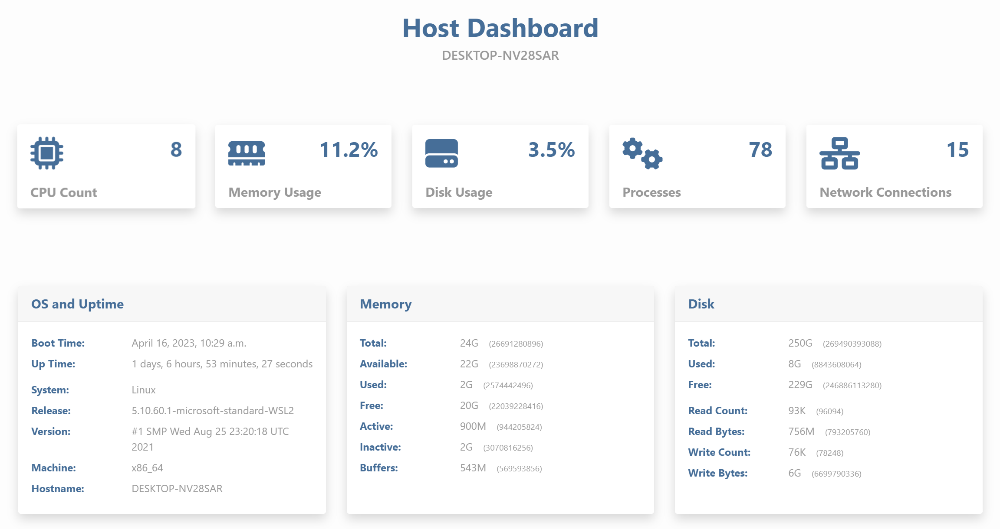
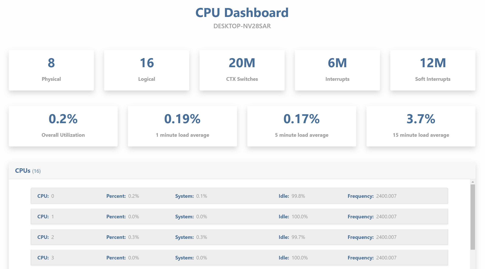
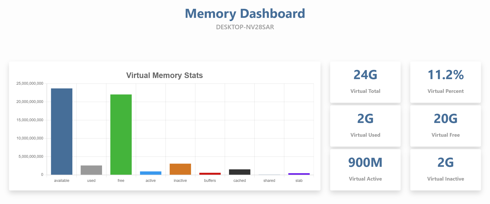
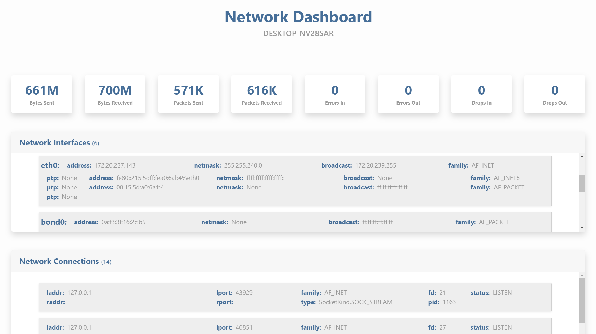

.. _features:

Features
========
Bootstrap 5 dashboard pages are provided for host summary, CPU status, disk partitions, memory usage, netowrk interfaces, and processes. Below are examples of each dashboard.

|
Host Dashboard
--------------
````

|
CPU Dashboard
--------------
````

|
Disk Dashboard
--------------
````

.. image:: images/disk.jpg
  :width: 600
  :alt: Alternative text

|
Memory Dashboard
----------------
````

|
Network Dashboard
-----------------
````

|
Process Dashboard
-----------------
````

.. image:: images/process.jpg
  :width: 600
  :alt: Alternative text

|
